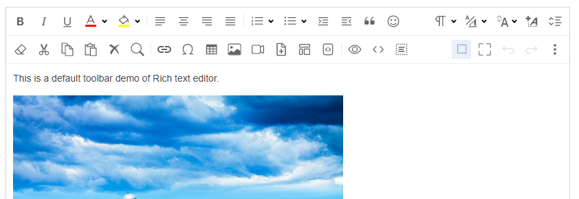

# RichTextBox for ASP.NET Core

**The professional WYSIWYG rich text editor Tag Helper for ASP.NET Core.**

[](https://richtextbox.com/)
[](https://www.nuget.org/packages/RichTextBox.AspNetCore)
[](https://richtextbox.com/Pricing)



RichTextBox is a professional WYSIWYG editor Tag Helper for ASP.NET Core that delivers a complete content-authoring experience out of the box. With a single tag, you get rich-text formatting, tables, image management, templates, and more — ready for production forms, CMS pages, and email composers.

## Key Features

- ASP.NET Core Tag Helper — just add `<richtextbox />` to any Razor page
- Clean, modern toolbar UI with responsive layout
- Paste from Word and Excel with automatic formatting cleanup
- Drag-and-drop image upload with server-side gallery
- Powerful table editing support
- Content templates with categories and preview
- Built-in code snippet highlighting
- Export to PDF and Word
- Autosave and draft recovery
- Context menu on images, tables, and links
- Multiple skins (Default, Office 2007 Blue)
- Full JavaScript API with 40+ methods
- Built-in `RichTextBox.lic` license validation
- Upload endpoint mapper for file and image handling

## Quick Start

```
dotnet run --project RichTextBox.WebSite
```

Open the URL printed in the console and browse `/Demos`.

## Getting Started with Tag Helper

**1. Add the Tag Helper in `_ViewImports.cshtml`:**
```razor
@addTagHelper *, RichTextBox
```

**2. Register services in `Program.cs`:**
```csharp
builder.Services.AddRichTextBox();
app.MapRichTextBoxUploads();
```

**3. Use in any Razor page:**
```html
<richtextbox name="Body" height="400px" />
```

## 100 Server-Side Demos

This package includes 100 working demos covering every feature:

| Category | Demos |
|----------|-------|
| Getting Started | Overview, Minimal Setup, Configuration, Tag Helper Basics, JavaScript API |
| Toolbar | Default, Full, Basic, Custom, Read-Only Mode |
| Text Formatting | Bold/Italic/Underline, Fonts, Colors, Line Height, Paragraph Format |
| Lists & Structure | Ordered/Unordered Lists, Todo Lists, Tables, Block Quotes |
| Links & Media | Insert Link, Image Gallery, Video, Document, Emoji, Code Blocks |
| Content Templates | Basic, Custom, Categories, Dynamic, Preview |
| Image Handling | Upload, Gallery Browse, Drag & Drop, Resize, Alignment |
| Autosave & Drafts | Basic Autosave, Custom Key/Delay, Multiple Editors, Recovery |
| Paste Handling | Auto Paste, Paste as Text, Paste from Word, Cleanup |
| Integration | Form Post, Model Binding, Ajax Submit, Multiple Editors |
| Advanced | Source Code View, Find & Replace, Format Painter, Full Screen |

[Browse all 100 demos online](https://richtextbox.com/Demos)

## What's Included

```
RichTextBox-Trial/
├── README.md
├── RichTextBox-Trial.slnx
├── RichTextBox.lic              # 30-day trial license
├── lib/
│   └── RichTextBox.dll          # Editor library
├── RichTextBox.WebSite/         # Demo website with 100 examples
│   ├── Pages/Demos/             # 100 demo pages
│   ├── Program.cs
│   └── wwwroot/
└── docs/                        # Setup and deployment guides
```

## NuGet Package

```
dotnet add package RichTextBox.AspNetCore --prerelease
```

[View on NuGet](https://www.nuget.org/packages/RichTextBox.AspNetCore)

## Requirements

- .NET 8 SDK or later

## Documentation

- [Getting Started](https://richtextbox.com/GettingStarted)
- [Installation Guide](https://richtextbox.com/Installation)
- [Class Reference](https://richtextbox.com/ClassReference)
- [FAQ](https://richtextbox.com/FAQ)
- [Deployment](https://richtextbox.com/Deployment)

## Links

- [Download Free Trial](https://richtextbox.com/Download)
- [Online Demos](https://richtextbox.com/Demos)
- [Features](https://richtextbox.com/Features)
- [Pricing](https://richtextbox.com/Pricing)
- [Documentation](https://richtextbox.com/Document)

## About Richscripts Inc

[Richscripts Inc](https://richtexteditor.com/aboutus.aspx) is a Canadian company established in 2003, specializing in high-quality, reusable web components and enterprise software solutions. With 33,000+ customers and over 1 million users worldwide, including Fortune 500 companies and global IT consultancies.

### Our Products

**Rich Text Editors**

[JavaScript Rich Text Editor](https://richtexteditor.com/) | [Rich Text Editor for ASP.NET](https://richtexteditor.net/) | [Rich Text Editor for PHP](https://phphtmleditor.com/) | [Rich Text Editor for Classic ASP](https://asp.richtexteditor.com/) | [Blazor Rich Text Editor](https://richtexteditor.com/blazor-rich-text-editor.aspx) | [RichTextBox for ASP.NET Core](https://richtextbox.com/)

**File Upload Components**

[Ajax Uploader](https://ajaxuploader.com/) | [PHP File Uploader](https://phpfileuploader.com/) | [ASP Uploader](https://aspuploader.com/) | [CoreUpload - ASP.NET Core Upload](https://coreupload.com/) | [MultipleUpload - JavaScript Upload](https://multipleupload.com/)

**Chat & Communication**

[MyLiveChat - Free Live Chat](https://www.mylivechat.com/) | [Dchat - AI Chatbot](https://dchat.com/) | [ZChat - On-Premises Live Chat](https://zchat.com/)

**Developer Tools**

[JavaScript Obfuscator](https://javascriptobfuscator.com/) | [Free .NET Obfuscator](https://freeobfuscator.com/) | [JavaScript Converter](https://javascriptconverter.com/)

---

<p align="center">
  <a href="mailto:support@richscripts.com">support@richscripts.com</a> | <a href="https://www.richscripts.com">www.richscripts.com</a>
</p>
